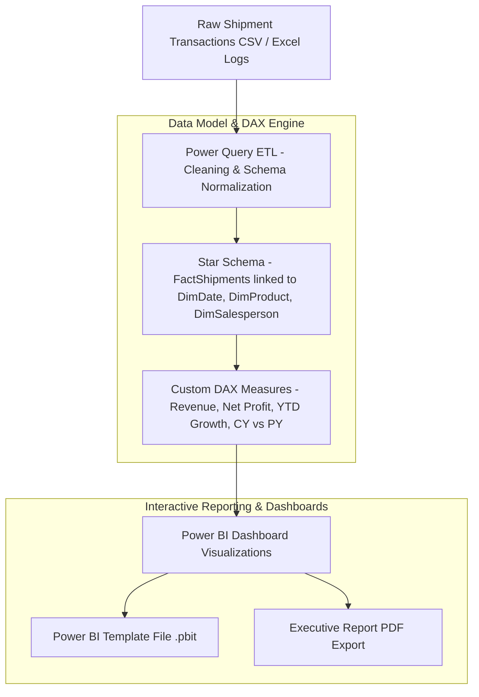

# SalesAnalytics — Commercial Sales & Shipment Analytics Platform

> **Status**: 🔵 Completed BI Project  
> **Target Identity**: SalesAnalytics  
> **License**: MIT License ([LICENSE](LICENSE))  

SalesAnalytics is an executive business intelligence (BI) and data analytics dashboard built with **Power BI Desktop**, **DAX (Data Analysis Expressions)**, and **Power Query**, engineered to transform multi-million dollar commercial shipment logs into actionable revenue, profit, and regional distribution insights.

---

## Overview

Executive sales teams need interactive BI dashboards to track revenue performance, compare current-year vs. prior-year (CY vs. PY) trends, evaluate regional profitability, and monitor product SKUs. **SalesAnalytics** models a commercial dataset spanning **\$141M+ in aggregate revenue** and **9M+ shipped units**, implementing a clean star-schema data model and custom DAX measures for executive reporting.

---

## Why I Built It

I built SalesAnalytics to master business intelligence development, dimensional data modeling (Star Schema), Power Query ETL transformations, and advanced DAX metric calculations. Key analytical challenges included building time-intelligence measures for year-over-year (YoY) comparison, calculating net profit margins across geographic regions, and designing clean visual hierarchies for executive decision-making.

---

## Architecture & Data Flow



---

## Key Features & Systems Design

- **Star-Schema Dimensional Data Model**: Links core shipment fact tables with normalized dimension tables (`Product`, `Salesperson`, `Geographic Region`, `Calendar Date`).
- **Custom DAX Financial Measures**:
  - `Total Revenue`: Aggregates total sales dollar value (\$141M total).
  - `Total Units Shipped`: Tracks box unit volume (9M total).
  - `Total Profit & Margin %`: Calculates net margin by subtracting unit costs from shipment revenue.
  - `Time-Intelligence (YoY)`: Calculates Current Year (CY) vs. Prior Year (PY) variance and percentage growth.
- **Executive KPI Cards & Drill-Downs**: High-level summary metrics with dynamic filtering by date, region, product, and sales agent.
- **Product & Geographic Leaderboards**: Visual rankings highlighting top-performing SKUs and country sales distribution.
- **Report Exports Included**: Includes both the reusable Power BI template (`chocolate_shipment_analytics_dashboard.pbit`) and a full PDF report export ([`chocolate_shipment_dashboard_PowerBi.pdf`](chocolate_shipment_dashboard_PowerBi.pdf)).

---

## Technical Stack & Tooling

| Component | Technology / Skill |
|---|---|
| **BI Platform** | Power BI Desktop |
| **Data Modeling** | Star Schema Dimensional Modeling |
| **Calculation Engine** | DAX (Data Analysis Expressions) |
| **ETL & Data Transformation** | Power Query M Engine |
| **Export Formats** | `.pbit` Power BI Template, PDF Executive Report |

---

## Repository Structure

```
SalesAnalytics/
├── chocolate_shipment_analytics_dashboard.pbit  # Power BI template report
├── chocolate_shipment_dashboard_PowerBi.pdf     # High-resolution PDF dashboard export
├── .gitignore                                   # Git untracked files rules
├── LICENSE                                      # MIT License
└── README.md                                    # Project documentation
```

---

## How to View & Open

### Option 1: View PDF Report Export (No Installation Required)

Inspect the rendered dashboard visuals in the included PDF report export:

📄 **[`chocolate_shipment_dashboard_PowerBi.pdf`](chocolate_shipment_dashboard_PowerBi.pdf)**

### Option 2: Open Template in Power BI Desktop

1. Download and install [Power BI Desktop](https://powerbi.microsoft.com/desktop/).
2. Double-click `chocolate_shipment_analytics_dashboard.pbit` to load the template.
3. Bind your dataset connection parameters to explore interactively.

---

## Security Audit & Verification Notice

An audit of source files found no obvious hardcoded credentials. Reports use parameterized data source definitions.

---

## Key Business Insights Discovered

- **Aggregate Revenue Analyzed**: \$141M+ total gross revenue across all global distribution channels.
- **Volume Shipped**: 9M+ unit boxes fulfilled across regional hubs.
- **Performance Distribution**: Identified top 10 revenue-generating product SKUs and highlighted underperforming sales territories for targeted commercial intervention.

---

## Limitations

- **Template File**: The `.pbit` template file stores report visuals, DAX definitions, and data models without embedding large raw transaction rows directly in the git repository.

---

## License

This project is licensed under the MIT License — see the [`LICENSE`](LICENSE) file for details.
